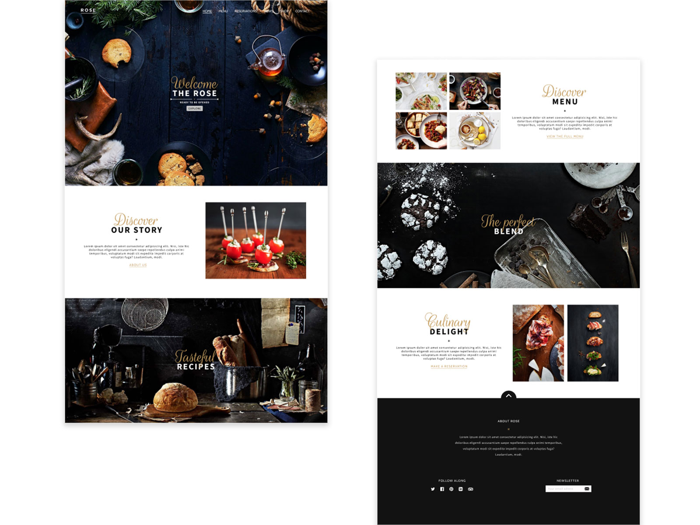

# The Rose

Projeto de uma Landing Page para o restaurante The Rose

 

 

## Fontes utilizadas no projeto
+ Cabin  
https://fonts.google.com/specimen/Cabin?preview.text_type=custom
<!--
+ Regular 400
+ Semi-bold 600
+ Extra-bold 800
+ Extra-bold 800 italic
https://fonts.google.com/specimen/Nunito+Sans
-->
+ Rouge Script  
https://fonts.google.com/specimen/Rouge+Script?preview.text_type=custom

+ Source Pro  
https://fonts.google.com/specimen/Source+Sans+Pro?preview.text_type=custom

 

## Utilizado scroll-behavior

+ Suporte: https://caniuse.com/?search=scroll-behavior

+ Tutorial para utilização: [How to animate scrolling to anchor links with one line of CSS](https://gomakethings.com/how-to-animate-scrolling-to-anchor-links-with-one-line-of-css/)

+ Alternativa: https://github.com/cferdinandi/smooth-scroll

 

## Utilizado Scroll Reveal (Para animar elementos ao rolar a página)

+ ScrollReveal: https://scrollrevealjs.org/

+ Guide: https://scrollrevealjs.org/guide/hello-world.html

<!--
## Layout Construído 
Figma - https://www.figma.com/ 
<!--
Donwload:  
+ Vá até a pasta Layout 
+ Selecione o arquivo Studo.fig
+ Clique no Botão Donwload para baixar o projeto
--> 

 

## Demo 
https://robsonvinicius.github.io/the-rose/
